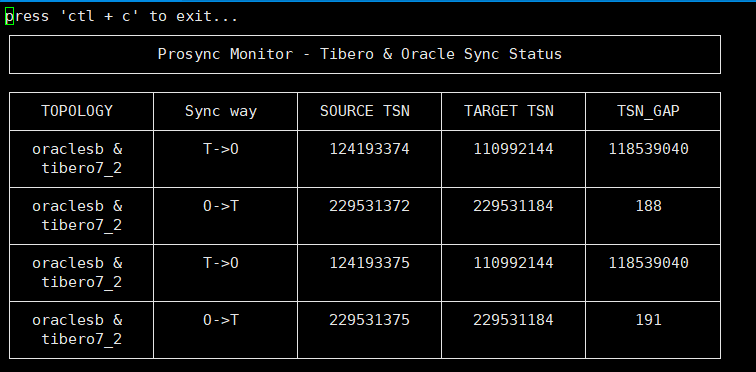

# Prosync Monitor
프로싱크 모니터링을 위한 jdbc 기반 조회 프로그램입니다 
oracle 과 tibero 데이터 베이스 세션을 통해 prs_lct, scn, tsn 비교 및 모니터링 수행 

## 사용법 
```
$  sh run_monitor.sh 
```


 ### 동작 화면



## 설정방법
config.yml 수정하여 설정 변경가능
```
monitor:
  mode: 77 (모니터 크기 지정 wide, 정수 임력가능)
topology:
  - name: ttt (첫번째 토플러지 이름 지정, 문자열 입력가능)
    source: (토플로지 `source` 의 설정 시작 부분) 
      dbType: tibero ( 접속할 디비 종류 tibero, oracle 입력가능 )
      ip: 192.168.1.187 (접속 ip)
      port: 4628 (접속 포트)
      connId: tibero (접속 db계정)
      connPwd: tmax (접속 db 계정 암호)
      proSyncUser: jsh_ott ( 프로싱크 유저명 source target 동일 )
      dbSid: tibero7_2 ( 접속 db sid)
    target: (토플로지 `target` 의 설정 시작 부분) 
      dbType: tibero ( 접속할 디비 종류 tibero, oracle 입력가능 )
      ip: 192.168.1.187 (접속 ip)
      port: 4628 (접속 포트)
      connId: sys (접속 db계정)
      connPwd: tibero (접속 db 계정 암호)
      proSyncUser: jsh_ott ( 프로싱크 유저명 source target 동일 )
      dbSid: tibero7_2 ( 접속 db sid)
  - name: tto (두번째 토플러지 이름 지정, 문자열 입력가능)
    source:
      dbType: tibero
      ip: 192.168.1.187
      port: 4628
      connId: tibero
      connPwd: tmax
      proSyncUser: jsh_tto
      dbSid: tibero7_2
    target:
      dbType: oracle
      ip: 192.168.1.188
      port: 1525
      connId: JSH_tto
      connPwd: jsh
      proSyncUser: jsh_tto
      dbSid: oraclesb
    ...
 

```
TtoT OtoT TtoO 토플로지 등록 예시
```
monitor:
  mode: wide
topology:
  - name: ttt
    source:
      dbType: tibero
      ip: 192.168.1.187
      port: 4628
      connId: tibero
      connPwd: tmax
      proSyncUser: jsh_ott
      dbSid: tibero7_2
    target:
      dbType: tibero
      ip: 192.168.1.187
      port: 4628
      connId: sys
      connPwd: tibero
      proSyncUser: jsh_ott
      dbSid: tibero7_2
  - name: tto
    source:
      dbType: tibero
      ip: 192.168.1.187
      port: 4628
      connId: tibero
      connPwd: tmax
      proSyncUser: jsh_tto
      dbSid: tibero7_2
    target:
      dbType: oracle
      ip: 192.168.1.188
      port: 1525
      connId: JSH_tto
      connPwd: jsh
      proSyncUser: jsh_tto
      dbSid: oraclesb
  - name: ott
    source:
      dbType: oracle
      ip: 192.168.1.188
      port: 1525
      connId: JSH_ott
      connPwd: jsh
      proSyncUser: JSH_OTT
      dbSid: oraclesb
    target:
      dbType: tibero
      ip: 192.168.1.187
      port: 4628
      connId: tibero
      connPwd: tmax
      proSyncUser: jsh_ott
      dbSid: tibero7_2
```
## 기능 
* oracle 과 tibero 데이터 베이스 세션을 통해 prs_lct, scn, tsn 비교
* mode 변수 통해 출력 크기 지정 가능
* 
